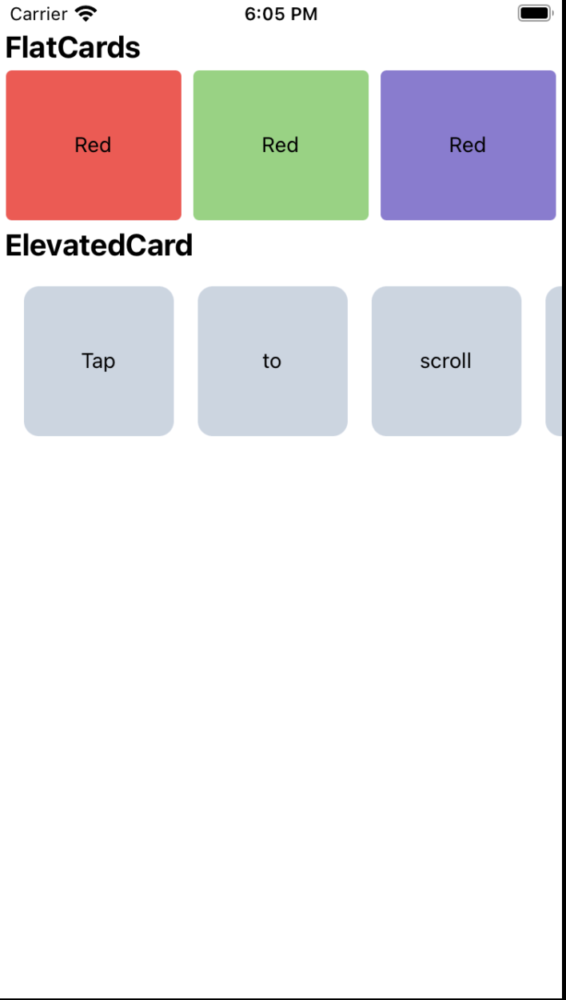

# Learn React Native Step by Step 
React Native is an open-source framework for building mobile applications using JavaScript and React, a popular JavaScript library for building user interfaces. It allows developers to write code once and create native mobile apps for multiple platforms, such as iOS and Android, without the need to develop separate apps for each platform. React Native uses native components and APIs, which makes the apps perform and look like traditional native apps. It offers a fast development cycle, efficient code reuse, and a rich ecosystem of third-party libraries, making it a popular choice for mobile app development.

# START Command
- npx react-native run-ios

## Lessons 3

#### Dynamic Theming in React Native: A Guide to Hooks

xThe `useColorScheme` hook returns a string representing the current color scheme of the device. It can have one of three possible values:

- "light": The user prefers a light color theme.
- "dark": The user prefers a dark color theme.
- null: The user has not indicated a preferred color theme

It's important to note that the `useColorScheme` hook relies on the device's operating system to provide the color scheme information. Therefore, its availability and accuracy depend on the device and OS version. Make sure to test your app on different devices and operating systems to ensure consistent behavior.
### code
````
import React from 'react';
import {StyleSheet,Text,useColorScheme,View} from 'react-native';
````
````
const App = () => {
  const colorScheme = useColorScheme();
  return (
    <View style={styles.container}>
      <Text style={colorScheme == 'light' ? styles.textdark : styles.textwhite}> {colorScheme}</Text>
    </View>
  );
};
````
````
const styles = StyleSheet.create({
  container: {
    flex: 1,
    alignItems: 'center',
    justifyContent: 'center',
  },
  textdark: {
    color: 'black'
  },
  textwhite: {
    color: 'white'
  },

});
````
````
export default App;
````


# Project 2 start 


## Lessons 4 (Design FlatCard)
- In this project first i create a components folder 
- inside that i create a FlatCard file with .tsx
- when i import FlatCard in App file and use it as a component 
- when i simpely design the FlagCard components
- flatCard file code  👇
````
import React from "react";
import {View,Text,SafeAreaView, StyleSheet} from "react-native";
````
````
function FlatCards()
{
    return (
    <SafeAreaView>
        <View>
            <Text style={styles.textstyle}>FlatCards </Text>
            <View style={styles.container}>
                <View style={[styles.card,styles.cardOne]}>
                    <Text>Red</Text>
                </View>
                <View style={[styles.card,styles.cardTwo]}>
                    <Text>Red</Text>
                </View>
                <View style={[styles.card,styles.cardThree]}>
                    <Text>Red</Text>
                </View>
            </View>
        </View>

    </SafeAreaView>)
}
````
````
const styles = StyleSheet.create({
    container:{ 
        flex:1,
        flexDirection:'row'
    },
    card:{
        flex:1,
        alignItems:'center',
        justifyContent:'center',
        margin:4,
    
        width:100,
        height:100,
        borderRadius:4,
        backgroundColor:"red "
        
    },
    cardOne:{
        
        backgroundColor:"red"
    },
    cardTwo:{
        backgroundColor:"green"
    },
    cardThree:{
        backgroundColor:"blue"
    },
    textstyle:{
        marginLeft:3,
        fontWeight:'bold',
        color:'black',
        fontSize:20

    }
})
````

````
export default FlatCards
````


## Lessons 5 (Design ElevatedCard)
###  ScrollView vs FlatList
`<ScrollView> vs <FlatList>` - which one to use?

ScrollView renders all its react child components at once, but this has a performance downside.

- In React Native, the ScrollView component is used to create a scrollable container that allows users to scroll through a list or content that exceeds the available screen space. It provides a way to handle scrolling of large amounts of data or content that cannot fit within a single screen.
- ```` import { ScrollView } from 'react-native'; ````
#### ScrollView properties:  horizontal,
- contentContainerStyle: Allows you to style the container of the content inside the ScrollView.
- horizontal: Set this prop to true if you want horizontal scrolling instead of vertical scrolling.
- scrollEnabled: Set this prop to false to disable scrolling.
- onScroll: A callback function that gets called when the scroll position changes.
- keyboardShouldPersistTaps: Determines whether the keyboard should stay open when tapping inside the ScrollView.
Other common properties like style, contentInset, contentOffset, etc., can be applied to customize the ScrollView.




## Lessons 6 (Guide to Images in React Native)
The image name is resolved the same way JS modules are resolved.
### Static Image Resources
- `<Image source={require('./my-icon.png')} />;`
- `var icon = this.props.active
  ? require('./my-icon-active.png') : require('./my-icon-inactive.png');`
<Image source={icon} />;
### Network Images

- `<Image source={{uri: 'https://reactjs.org/logo-og.png'}} style={{width: 400, height: 400}} />`


# Style in react-native 
To get box shadow for both platforms, use both sets of style props:
````
boxWithShadow: {
    shadowColor: '#000',
    shadowOffset: { width: 0, height: 1 },
    shadowOpacity: 0.8,
    shadowRadius: 2,  
    elevation: 5
}
````
````
Flexbox
- Understanding Flexbox Terminology:
- Flex Container: The parent component that applies Flexbox layout properties to its children.
- Flex Items: The child components inside the flex container that are laid out using Flexbox.
````
````
# Applying Flexbox to a Container
- style={{ flex: 1 }}
````
````
Flex Direction:

The flexDirection property determines the direction in which flex items are laid out within the flex container. It can have one of the following values:

- row: Flex items are arranged horizontally (default).
- column: Flex items are arranged vertically.
- row-reverse: Flex items are arranged horizontally in reverse order.
- column-reverse: Flex items are arranged vertically in reverse order.

<View style={{ flex: 1, flexDirection: 'row' }}>
  {/* Flex items go here */}
</View>
````
````
Justify Content:

The justifyContent property determines how flex items are positioned along the main axis (defined by flexDirection) within the flex container. It can have the following values:

- flex-start: Flex items are positioned at the beginning of the container (default).
- flex-end: Flex items are positioned at the end of the container.
- center: Flex items are centered within the container.
- space-between: Flex items are evenly distributed with equal spacing between them.
- space-around: Flex items are evenly distributed with equal spacing around them.
````
````
Align Items:
The alignItems property determines how flex items are positioned along the cross axis (perpendicular to the main axis) within the flex container. It can have the following values:

- flex-start: Flex items are aligned at the start of the container.
- flex-end: Flex items are aligned at the end of the container.
- center: Flex items are centered within the container.
- stretch: Flex items are stretched to fill the container.
- baseline: Flex items are aligned based on their baseline.

<View style={{ flex: 1, alignItems: 'center' }}>
  {/* Flex items go here */}
</View>
````
````
Flex Item Properties:
Each flex item can have its own properties to control its behavior within the flex container. Some commonly used properties include:
- flex: Determines how the item grows or shrinks relative to other items. Higher values indicate more growth or shrinkage.
- alignSelf: Overrides the alignItems value for an individual item.
- flexBasis: Sets the initial size of the item before any remaining space is distributed.
- flexGrow: Specifies how much the item can grow if there's available space.
- flexShrink: Specifies how much the item can shrink if there's a
````


## Credits

Special thanks to [Hitesh Choudhary Sir](https://www.youtube.com/@HiteshChoudharydotcom) for their excellent tutorials and guidance throughout the development of this project. Their instructional videos, particularly [React Native Mastery with 10 apps ](https://www.youtube.com/watch?v=kGtEax1WQFg&list=PLRAV69dS1uWSjBBJ-egNNOd4mdblt1P4c&pp=iAQB), provided invaluable knowledge and expertise that greatly influenced the implementation of this project. We highly recommend checking out their YouTube channel for more educational content.

